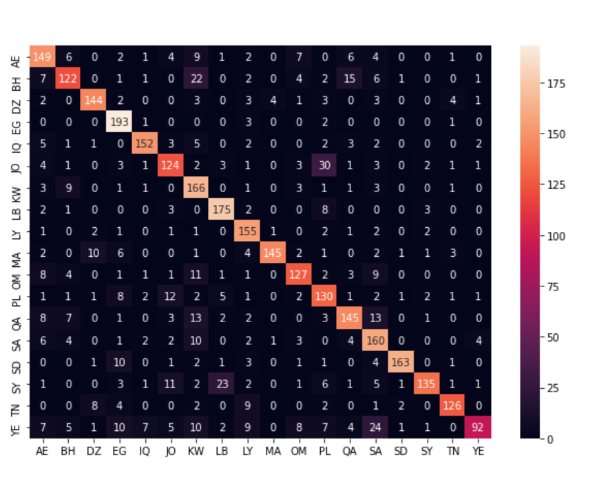

# Tweet-level Arabic Dialect Identification

### January 2021

### Abstract

Arabic Dialect Identification (ADI) on written text is the task of classifying the dialect of a given Arabic text. ADI is a challenging, yet a crucial task, having a significant role in machine translation and speaker identification. 
In this work, we consider the task of tweet-level ADI using the recently proposed QADI dataset [1]. We compare the results of training and testing the following standalone models:
- The base ArabicBERT [3], a pretrained BERT-base language model for Arabic.
- The medium ArabicBERT, a pretrained BERT-medium language model for Arabic.
- A feature engineering approach, using word-level and character-level n-grams to train a multi-layer perceptron (MLP).

We also present a novel pipeline that uses these models and applies various ensemble methods. 

The medium ArabicBERT model showed the best results when trained for 8 epochs among the standalone models with an F1-score of 77.03. Our Weighted Soft Voting approach has shown the best results with a macro-averaged F1-score of 78.80% across 18 classes, achieving a new state-of-the-art result in tweet-level multi-class ADI.

### 1. Introduction

The Arabic Language is one of the oldest and richest languages, spoken by over 400 million people worldwide. It is the 4th most used language on the Internet. Arabic has three variations:
- **Classical Arabic (CA):** Used in the Quran, poetry, and old scriptures.
- **Modern Standard Arabic (MSA):** The formal variant used in education, print, and law.
- **Dialectical Arabic (DA):** Used in daily life and informal communications.

Most Arabic Natural Language Processing (NLP) research has focused on MSA, but the rise of DA material on social media has increased interest in developing datasets and models to process DA. 
This work focuses on the tweet-level classification of 18 Arabic dialects using the QADI dataset. The main contributions are:
1. Fine-tuning existing transformer-based pre-trained models (AraBERT [2], medium ArabicBERT, and base ArabicBERT) on the QADI dataset.
2. Develope a feature engineering approach that uses word-level and character-level n-grams.
3. Evaluate and compare the results of the models.
4. Developing a pipeline that sets new state-of-the-art results by applying different ensembling methods on the results of the previously mentioned standalone models.

### 2. Related Work

The interest in this task has significantly increased in the last decade. Early works used language modeling approaches, and many shared tasks were organized to tackle ADI. For example:
- The Discriminating between Similar Languages (DSL) shared task at VarDial2016 focused on identifying Arabic dialects in speech transcripts.
- The MADAR shared task included sub-tasks like identifying city-level and country-level dialects from tweets.

BERT-based models, especially AraBERT, have become state-of-the-art for ADI tasks.

### 3. Proposed Approach

In this work, ArabicBERT models (medium and base) were preferred over AraBERT due to their larger pre-training datasets and inclusion of dialectal data. The proposed pipeline involves the following steps:

#### 3.1 Preprocessing

- User mentions and URLs were replaced with placeholders.
- Emojis and hashtag signs were removed.
- Farasa segmenter was used for sub-word unit segmentation, for instance, the word "wKalimatuna" "كلمتنا" meaning "and our word" can be partitioned into the preffix "w" "و" and the stem "kalimatu" "كلمة"and the suffixx "na" "نا".
After the normalization and segmentation processes, we started building up thefollowing classifiers.

#### 3.2 ArabicBERT

- Fine-tuned the medium and base ArabicBERT models on the QADI dataset by adding a dense layer and a softmax classifier on top of the pre-trained model.
- We have trained the medium, base for 8, and 4 ephocs respectively with maximum sequence length of 128 using the Adam optimizer to minimize the cross-entropy with a decaying learning rate and a batch size of 16.

#### 3.3 N-grams Model

- Extracted and vectorized word-level (unigrams and bigrams) and character-level (2-6 sub-words) n-grams using TF-IDF scores.
- Trained an Multi-layer perceptron (MLP) with one hidden layer consisting of 64 hidden units.
-  The mlp has been trained using the extracted features for 5 ephocs, a batch size of 32 and a learning rate of 0.0001.

#### 3.4 Ensembling Methods

- **Hard Majority Voting**: Selected the prediction most predicted by the candidate models.
- **Unweighted Soft Voting**: Averaged softmax probabilities across the candidate models.
- **Weighted Soft Voting**: Assigned different weights for each model and averaged softmax probabilities.

### 4. Experiment Settings

#### 4.1 Dataset

The QADI dataset[1] consists of 540k training tweets and 3502 test tweets, covering 18 dialects. In this work, we were only
able to retrieve 481,781 training tweet (approximately 90% of the tweets) due
to unavailability of the rest. The following table shows the distribution of the retrieved tweets over the 18 classes.

                            | Country | Train  | Test |
                            |---------|--------|------|
                            | AE      | 26,951 | 192  |
                            | BH      | 25,910 | 184  |
                            | DZ      | 16,890 | 170  |
                            | EG      | 59,977 | 200  |
                            | IQ      | 16,537 | 178  |
                            | JO      | 30,208 | 180  |
                            | KW      | 45,946 | 190  |
                            | LB      | 32,752 | 194  |
                            | LY      | 36,706 | 169  |
                            | MA      | 10,823 | 178  |
                            | OM      | 21,023 | 169  |
                            | PL      | 43,223 | 173  |
                            | QA      | 33,202 | 198  |
                            | SA      | 28,764 | 199  |
                            | SD      | 15,693 | 188  |
                            | SY      | 16,686 | 194  |
                            | TN      | 10,398 | 154  |
                            | YE      | 10,092 | 193  |

#### 4.2 Baseline

The AraBERT model [2] was fine-tuned on the QADI dataset as a baseline.

### 5. Experiments

Reported results of evaluating the models on the QADI test set. The medium ArabicBERT trained for 8 epochs showed the best standalone performance. Ensemble methods, especially weighted soft voting, improved the results further.

| Model                       | Recall | Precision | F1    | Accuracy |
|-----------------------------|--------|-----------|-------|----------|
| AraBERT [4]                 | -      | -         | 60.60 | -        |
| AraBERT                     | 73.38  | 75.20     | 73.30 | 73.27    |
| MLP                         | 51.43  | 55.48     | 49.67 | 51.13    |
| Base ArabicBERT (4 epochs)  | 75.55  | 77.12     | 75.53 | 75.45    |
| Medium ArabicBERT (4 epochs)| 57.19  | 58.13     | 56.04 | 57.13    |
| Medium ArabicBERT (8 epochs)| 77.07  | 78.01     | 77.03 | 76.99    |
| Hard Majority Voting        | 76.91  | 78.39     | 76.85 | 76.81    |
| Unweighted Soft Voting      | 78.24  | 79.92     | 78.20 | 78.17    |
| Weighted Soft Voting        | 78.88  | 80.34     | 78.80 | 78.81    |

### 6. Discussion

The Classification errors can be categorized into the following categories:
-   Classification error generated by the misclassification of geographically close country dialects, such as countries existing in the same region.
-   Classification error generated by the misclassification of dialects across all regions.

Based on inspecting some misclassified tweets, we argue that this mismatch between neighboring countries is caused by the fact that in some cases, a tweet can be classified accurately by more that one dialect. For instance, the tweet “هذا اللي يقولك يموت ولا ينسى” “This is what they say he dies and never forgets” can be classified as any of the Gulf dialects.

By inspecting the misclassified tweets in cases where the misclassified dialect is from another region, we observed that the reason of this mismatch is that the tweets are either too short or include some common phrase that can be used by any Arab . For example: the tweet “ههه الله يهدي البال”, “hhh may god give piece of mind”, includes only a quote used in almost all the Arabic countries regardless of the region.

### References

1. Mostafa Samir Abdelrahman Mattar Hesham Al-Bataineh Mohammad Zaghloul Ahmad Mustafa Bashar Talafha Abed Alhakim Freihat Ahmad Ragab, Haitham Seelawi and Hussein T. Al-Natsheh. Mawdoo3 ai at madar shared task: Arabic fine-grained dialect identification with ensemble learning. 2019.

2. Fady Baly Wissam Antoun and Hazem Hajj. Arabert: Transformer-based
model for arabic language understanding. pages 9 15, 2020.

3. Ali Safaya, Moutasem Abdullatif, and Deniz Yuret. KUISAIL at SemEval-
2020 task 12: BERT-CNN for offensive speech identification in social media.
In Proceedings of the Fourteenth Workshop on Semantic Evaluation, pages
2054{2059, Barcelona (online), December 2020. International Committee
for Computational Linguistics.

